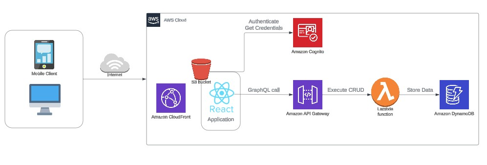

# Serverless Notes App

## Description
The Serverless Notes App is a dynamic application built with React and AWS serverless technologies, designed for note-taking with functionalities to create, read, update, and delete notes. It leverages AWS Lambda, API Gateway, and DynamoDB for backend logic, and AWS S3 and CloudFront for content hosting and delivery.

## Features

- CRUD operations: Create, Read, Update, and Delete notes.
- Note validation: Notes must be longer than 20 characters and shorter than 300 characters.
- Notes listing: Main page lists all created notes.
- Search functionality: Users can search for notes based on their content.


## AWS Environment Setup

Before deployment, set up your AWS environment:
- Create an [AWS account](https://aws.amazon.com/premiumsupport/knowledge-center/create-and-activate-aws-account/).
- Install and configure [AWS CLI](https://aws.amazon.com/cli/) with your credentials.

## Installation and Configuration

1. Clone the repos: `git clone https://github.com/JuansonGrajales/serverless-notes-app.git`
2. Navigate to the project directory: `cd serverless-notes-app`
3. Install dependencies for both Frontend and Backend: `npm run install:all`
4. Deploy with Serverless Framework: `npm run deploy`
5. After deployment, copy the GraphQL endpoint provided by the Serverless output.

### Configure Frontend
6. Navigate to the frontend directory: `cd notes-ui`
7. Create a `.env` file and add the GraphQL endpoint: e.g.`VITE_GRAPHQL_URI=https://gateway.execute-api.region.amazonaws.com/dev/graphql`

### Run Locally
To run the project locally, execute the following command in the main directory or within `notes-ui`:
```sh
npm run dev
``` 
### Deploying to the Web

#### BUILDING THE REACT APP
```sh
cd notes-ui
npm run build
```
#### UPLOADING FILES TO S3
GO to the S3 console
Click on the `Objects` Tab.  
Click `Upload`  
Drag the 2 files from the `/dist` folder onto this tab and Drag the 1 folder on this bucket

Click `Upload` and wait for it to complete.  
Click `Exit`  
Verify All 2 files (index.html, vite.svg) and 1 folder (assets) are in the `Objects` area of the bucket.

#### TESTING THE DEPLOYMENT
Go to CloudFront and copy the Distribution domain name.
Paste the domain in your browser's address bar. The Serverless Notes App should load.

## Using Serverless Framework
Ensure the Serverless Framework is installed. Deploy the backend from the main directory or notes-api using:
```sh
serverless deploy
```
Copy the GraphQL endpoint for frontend configuration as described above.

## Env Variables
Under notes-ui, create a .env file and add your AWS API Gateway endpoint:
e.g. `VITE_GRAPHQL_URI=https://gateway.execute-api.region.amazonaws.com/dev/graphql` 

For additional resource checkout [Vite Env vars](https://vitejs.dev/guide/env-and-mode)

## Arch Decisions
### Generating IDs in the API (GraphQL Resolver) 
**pro:** Leverages the UUID library in Node.js to ensure uniqueness.

**con:** The ID is known only after server processing, potentially introducing UI delays.

### NoSql vs Sql
Prioritized on performance and high availability. We can scale the DynamoDB table's capacity up or down and it is another serverless service fully managed by AWS.

### Caching
Implementing caching strategies that leverage Apollo Client's in-memory cache following mutations on DynamoDB.

**pro:** Immediate UI updates and reducing network traffic.

**con:** Overhead of manual cache updates and complexity in cache management as the application grows.

### Serverless Framework
**pro:** Quick setup of backend infrastructure with Lambda, API Gateway, and DynamoDB.

**con:** May require migration to Terraform for expanded features and complex infrastructures. 

## Tech Stack

- [React](https://react.dev/)
- [Vite](https://vitejs.dev/guide/why.html)
- [GraphQL](https://graphql.org/)
- [Apollo Server/Client](https://www.apollographql.com/docs/)
- [AWS CLI](https://aws.amazon.com/cli/)
- [AWS Lambda](https://aws.amazon.com/lambda/)
- [AWS Gateway](https://aws.amazon.com/api-gateway/)
- [AWS DynamoDB](https://aws.amazon.com/dynamodb/)
- [AWS S3](https://aws.amazon.com/s3/)
- [AWS CloudFront](https://aws.amazon.com/cloudfront/)
- [Serverless Framework](https://www.serverless.com/)

## Clean Env
1. If deployed to the web, go to the S3 console and remove all the objects inside the bucket
2. To remove the deployed service and avoid unexpected charges, navigate to notes-api and run:
```sh
serverless remove
```
This command deletes all AWS resources created by the project.


